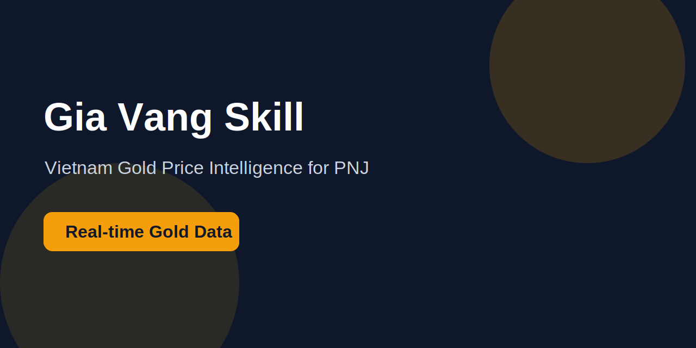

# Gia Vang Skill



A lightweight skill/API integration for retrieving Vietnamese gold prices from PNJ (Phu Nhuan Jewelry) — one of the largest and most trusted gold retailers in Vietnam.

## ✨ Features

- Real-time gold price retrieval from PNJ
- Simple and lightweight integration
- Designed for AI agents, automation tools, and dashboards
- Easy to extend for additional Vietnamese gold providers
- MIT Licensed

---

## 📌 Use Cases

Gia Vang Skill can be used for:

- AI assistants that answer gold price queries
- Financial dashboards
- Gold price monitoring bots
- Telegram/Discord automation
- Market tracking systems
- Vietnamese fintech applications

---

## 🏗 Project Structure

```bash
.
├── assets/
│   └── banner.svg
├── README.md
└── src/
```

---

## 🚀 Getting Started

### Clone Repository

```bash
git clone https://github.com/tinbeta/gia-vang-skill.git
cd gia-vang-skill
```

### Install Dependencies

```bash
# Example
pip install -r requirements.txt
```

### Run

```bash
python main.py
```

---

## 📊 Example Output

```json
{
  "brand": "PNJ",
  "gold_type": "24K",
  "buy_price": "11800000",
  "sell_price": "12100000",
  "currency": "VND"
}
```

---

## 🔮 Roadmap

Planned future improvements:

- Support SJC gold prices
- REST API mode
- Web dashboard
- Historical price charts
- WebSocket live updates
- Multi-language support

---

## 🛡 License

This project is licensed under the MIT License.

---

## 👨‍💻 Author

Created and maintained by Tinbeta.

If you find this project useful, consider giving it a ⭐ on GitHub.
